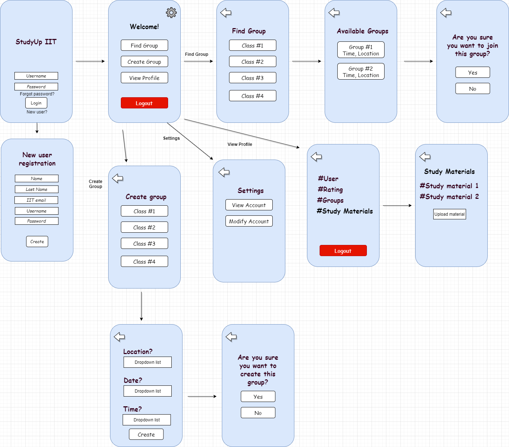
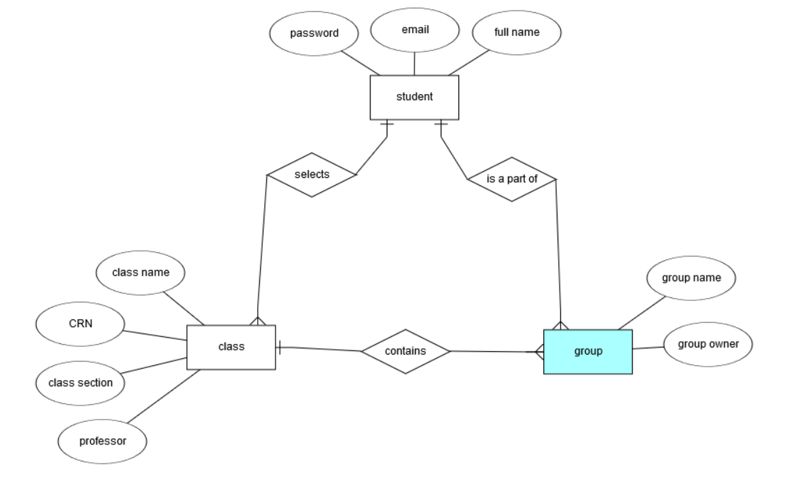
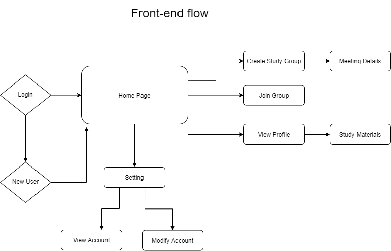

# Sprint-01 Report

## Team Number 09

Daniel Denekew *UI/UX Developer, Developer*

Pablo Villagomez *Operating systems and IT Infrastructure, Jr. Developer and Security*

Desmond Mair *Project Manager, Developer*

## UI/UX Report

Displayed in the diagram above is the first iteration of our mock-up UI. We decided to keep the UI clean, simple and easy to use to allow users to effortlessly navigate the application and perform whatever task they desire with ease. This communications app can be compared to Slack or Discord but is tailored specifically towards IIT students looking for study groups for their classes. Blackboard has a specific feature that allows students to connect with each other to form groups. However, Blackboard has not expounded on this feature and it hardly gets utilized by students due to difficulty finding the feature and a cluttered UI that makes it unpleasant to use.

## Developer Report

The language we will be using is Java as it is the language our group is most experienced with. We will also be using mySQL to link our app to the database where we will be storing usernames, passwords, ratings, study groups, study materials, etc.

## IT Infrastructure Report

We decided that we will primarily develop this app for Android devices running Android OS, but may later expand to other platforms such as iOS. The reasoning behind this choice is ease of coding for Android through Android Studio, and that it is one of the most popular mobile device operating systems along with iOS. As for data storage, we will be utilizing cloud storage rather than physical servers as it is cheaper, easier to maintain and typically has no down time.

## Developer and Security Assumptions

One main security feature this app will contain is restriction of creating users. Profiles will only be able to be created using hawk emails provided by IIT. This not only prevents non-IIT students from creating an account, but also eliminates the possibility of the creation of multiple accounts by one person. Also, usernames and passwords will be encrypted to prevent unauthorized access to accounts.

## User Story

This app will firstly consist of a login screen where you either log in to an existing account or allow new users to create an account. Once logged in, it will direct you to a main menu where the user has the choice of either finding a group, creating a group or viewing their profile.

- If the user selects find group, it will take them to a secondary menu that contains a list of all existing classes that groups were created for. Once a class is selected, it will then display all the groups created for that class, if any exist, and allow the user the option of selecting a group to join.

- If the user selects to create a group, it will prompt them to select a class they would like to create the group for. It will then prompt the user to enter a location and timeframe for when and where the group will meet (future iterations may include an online chatroom for the groups).

- If the user selects view profile, it will display their username, rating, groups that the user is a part of and study materials. The rating feature will work similarly to that of Uber, where users get rated by other peers based on their behavior, contribution and participation in the group. The rating feature as of right now is optional, meaning it is not mandatory for users to submit ratings, and will likely change to a different feature that does a similar job in a less toxic manner.

## Admin Story

The admin will be able to archive accounts when students have graduated and no longer need to use our app. The admin is also able to suspend accounts in cases where a user may violate community standards. The suspension may be indefinitely or whatever length of time the admin deems necessary. The admin may also be able to modify user accounts if necessary. For example, the admin is able to reset passwords for users who forget their passwords. Lastly, the admin is able to provide admin privileges to other accounts in case their needs to be moderators in the app.

## Atomic Goals for Sprint-02

### UI/UX
- Making sure website is customizable and easy to use
- Understanding how it can be compatible with multiple browser
- Clean design and effective color scheme

### Developer
- Get familiar with Android Studio.

### Junior Developer and Security
- Explore how to restrict registration based on email hosts.
- Research best practices for encryption
- Research other security options for app

### Operating Systems and IT Infrastructure
- Explore possible cloud storage options for app
- Analyze possibility of having cross-platform app
- Look into SQL schema corresponding to UI/UX diagram

### Project Manager
- Prepare visual presentation.
- Possible Kanban board such as Trello for future organization of tasks.
- Survey data from IIT students to explore features to be added/removed.
