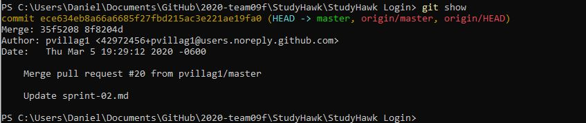
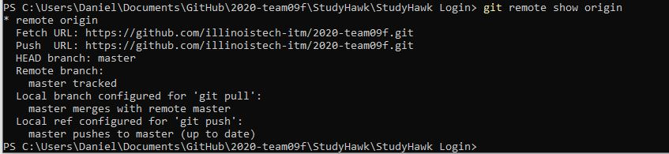
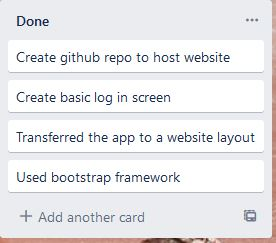

# Sprint-02 Report

## Team Number 09

Daniel Denekew *UI/UX Developer, Developer*

Pablo Villagomez *IT Infrastructure, Jr. Developer and Security*

Desmond Mair *Project Manager, Developer*

## Project Manager

https://github.com/illinoistech-itm/2020-team09f
https://trello.com/b/utYoK6IF/itm430-team-09
https://itmt-430-team9.slack.com/archives/CSQ6B7DS6

## Atomic Goals for Sprint-03

- Connection to Database via Nodejs and MongoDB or MySQL and Phpmyadmin.
- Add the user layout pages
- Allow Admin to access the site
- Use HTTPS for an encrypted website connection

## UI/UX Report

- Created a simple user-friendly login page utilizing an IIT-themed color palette.
- Login page is mobile friendly and compatible with multiple browsers.
- Login page has a ‘Forgot password’ option and a ‘Sign up’ option.

## Developer Report

- Created a functioning front-end of a log in page.
- Created sign up page.
- Created Forgot password page.

## IT Infrastructure Report

- Developing website app, allows cross-platform flexibility
- Considered using node.js and MongoDB for back-end functionality

## Developer and Security Assumptions

- Researched OAuth 2.0 to access Google APIs for user access to web app
- Researched encryption of data at rest for capabilities with MongoDB
- Initiated research into HTTPS for encrypted web app connection
