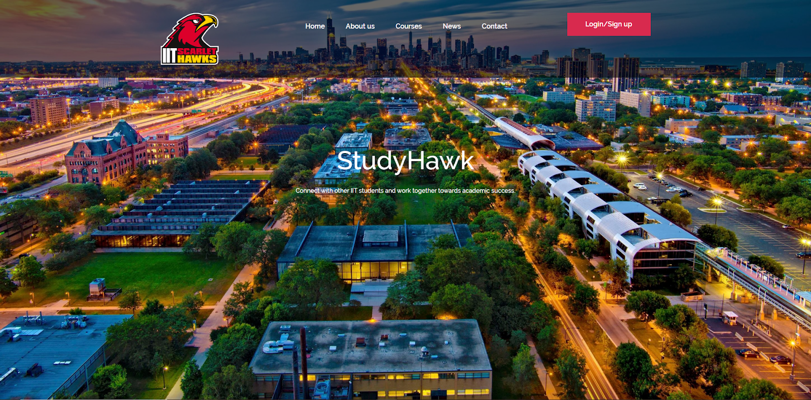
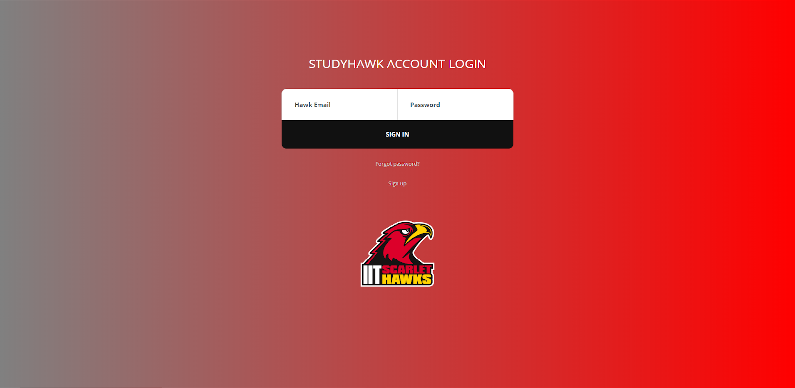
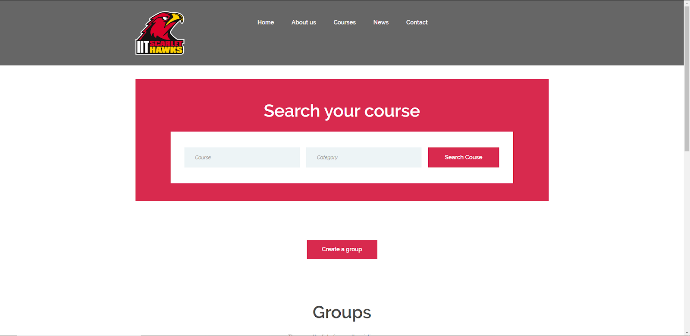

# Sprint-04 Report

## Team Number 09

Daniel Denekew *IT Infrastructure, Jr. Developer and Security*

Pablo Villagomez *Project Manager, Developer*

Desmond Mair *UI/UX Developer, Developer*

## UI/UX Artifacts

A front end template of the home page was created. The Login/Sign Up button leads to the login page below:

On a successful login, the user will be redirected to the main page where they may search for a group based on course, or create a group:

When “Create a Group” is clicked, it will bring the user to a screen where they fill out a form to create a group:

Currently, the pages are still only front end HTML, CSS, and JavaScript, and are not live. The color palettes are subject to updates and the pictures are placeholders.

All pages were made based off of the wireframes of the flow of the website under the diagrams folder in Github.

## IT Infrastructure 

## Developer
- Front end HTML pages were made with CSS and JavaScript: landing home page, login page, main page, create group page and search group page.

## Developer and Security Assumptions

## Project Manager