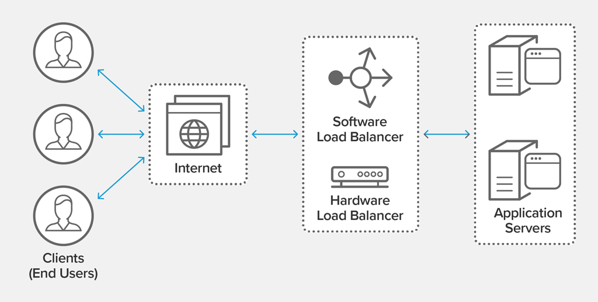

# Sprint-05 Written Report

## Team Number 09

Daniel Denekew *IT Infrastructure*

Pablo Villagomez *Project Manager, Developer*

Desmond Mair *UI/UX Developer, Developer*

### UI/UX Artifacts

- Front end HTML templates were created for both the user and admin story including custom CSS and Javascript, and a custom login page. These items were customized with color palettes and logos representing IIT. Snapshots of these pages can be seen below:
- Main landing page:

- Login page:

- Search/Create group page:

- Create group form page:

- Current groups page:

- Contact info page:

- The admins will have the exact same pages with some minor adjustments including a page to view all viewers and options to edit and delete groups.
- Users page (admin):

- Group/Users page:

- These pages were designed based on the wireframes for the user/admin story in the diagrams folder:
[Link to diagrams folder](https://github.com/illinoistech-itm/2020-team09f/tree/master/StudyHawk/diagrams)

- Below are screenshots of the commits for the wireframe images, login page, and main page:

### Developer

- We attempted to link our front-end with our back-end, however, we were not successful as we struggled with setting up our database and server.
- The following link is for the commits of our first attempt of setting up our database and server using MongoDB/Node.js.
https://github.com/illinoistech-itm/2020-team09f/commit/aa5cedf4de3632bdc715f0a4e278def81937744c
- They include the required dependencies, but other team members were not able to set up the server/database on their end. Afterwards, we attempted to build our server and database based on the example given by Professor Jeremy as shown in our infrastructure report.

### Infrastructure

- A load balancer monitors a given port on each VM and only distributes traffic to an operational VM.
- By defining a front-end IP configuration that contains one or more public IP addresses. - This front-end IP configuration allows the load balancer and applications to be accessible over the Internet.
- Virtual machines connect to a load balancer using their virtual network interface card (NIC). To distribute traffic to the VMs, a back-end address pool contains the IP addresses of the virtual (NICs) connected to the load balancer.
- To control the flow of traffic, we define load balancer rules for specific ports and protocols that map to our VMs
- Created two Virtual box, Ubuntu-Vanilla & Centos-Vanilla. Was able to edit using vim and modified the host Ip addr

- The virtual box physical appearance while running.

-	Building the Centos-vanilla Vbox

-	Building the Centos-Vanilla IP addr

-	Centos pings the ubuntu ip address

-	However, we were unable to establish the connection of the database through the virtual machine.
-	The idea of creating a virtual machine based Load-Balancer to route between two copies of the front end virtual machines was suppose to 
-	Inversely pings Centos-Vanilla from Ubuntu-vanilla

-	Modified and added the ubuntu localhost ip addr

- Installed nginx

- The localhost is established through nginx

- Updates the virtual machine as needed

- Sample of discrete systems

- The sample virtual machine based Load-Balancer to route between two copies of the front end virtual machines

- A sample diagram of all of the discrete servers and their IP addresses in your application

### Project Manager

In terms of our final deliverable, we have our front-end completed. The front-end depicts our intended user story as well as our admin story. The forefront was created to accurately represent the Illinois Tech spirit and it is responsive to any device or screen size. However, as great as our front-end might be, we have not been able to add back-end functionality to make it all complete. We struggled to link our database/server to the front-end. At first, we attempted to follow our original goal of using MongoDB/Node.js, but failed at making it run with the front-end. So then we tried to follow the examples given by Prof Jeremy, but were also unsuccessful at getting it to link to our front end. Therefore, we do not have a live demonstration we can recreate because our final deliverable is not executable.  
